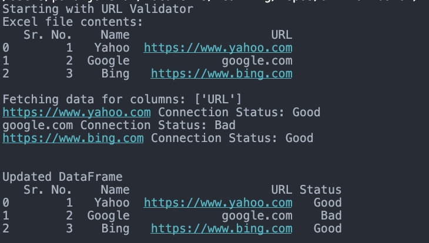

[](https://github.com/pawanJ09/url-validator/actions/workflows/build.yml)
[](https://github.com/pawanJ09/url-validator/actions/workflows/package.yml)

# Excel URL Validator

Validates list of URLs given in the provided Excel.

## Requirements

For building and running the application you need:

- [Python3](https://www.python.org/downloads/)

```shell
pip3 install -r requirements.txt
```
OR
```shell
pip install -r requirements.txt
```

## Running the application locally

You can run the main.py program to get started. This file has the __main__ method.

```shell
python3 ./src/main.py
```
OR
```shell
python ./src/main.py
```

## Test Results


